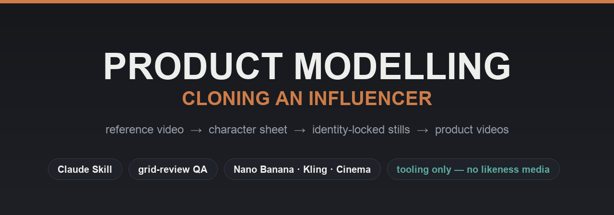
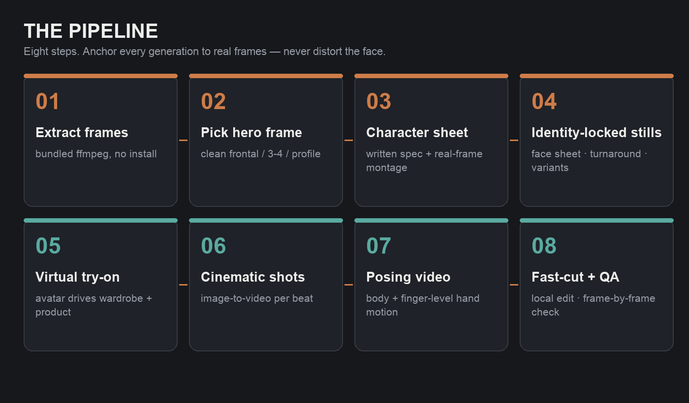
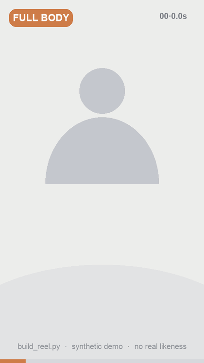
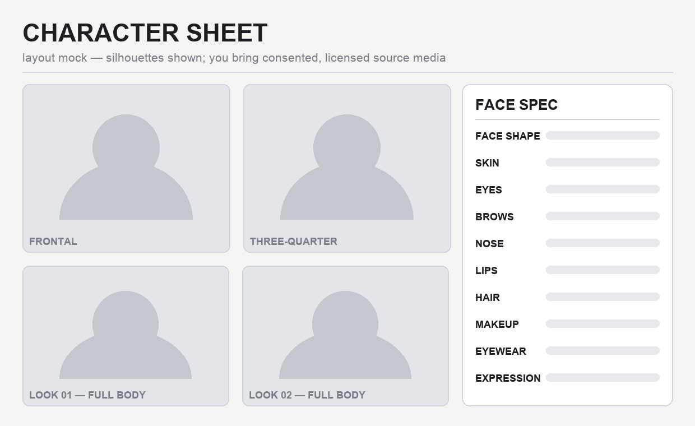

<p align="center">
  
</p>

<p align="center">
  
  
  
  
  
</p>

# Product Modelling — Cloning an Influencer

A reusable, **zero-install** pipeline (packaged as a Claude Code / Agent skill) for cloning a real
model or influencer from a reference video and producing **product-modelling videos** — eyewear,
apparel, accessories — **without distorting the person's face**.

> ⚠️ **This repo ships the *method and tooling only.*** It contains **no** real-person likeness media,
> no cloned faces, no brand footage, and no product photography. Bring your own properly-licensed
> source material, and make sure you have the rights/consent to clone any real person before you do.

## What's inside

```
SKILL.md                         # the full 8-step pipeline + operating principles
references/
  engine-catalog.md              # which generation model for which job (image + video)
  gotchas-and-uploads.md         # upload flow, large-file PUT fix, content-filter & preset gotchas
  posing-prompt-library.md       # researched fashion posing + hand-gesture prompt phrases
  character-sheet-template.md    # the written face-spec format + face-lock prompt fragment
scripts/
  build_sheet.py                 # build a labelled character/reference sheet from real frames (PIL)
  build_director_grid.py         # build a creative-director storyboard grid sheet
  build_reel.py                  # local fast-cut montage (ffmpeg trim/crop/concat, punch-in zooms)
```

## The pipeline (TL;DR)

<p align="center"></p>

1. **Extract frames** from the reference clip (bundled ffmpeg via `imageio_ffmpeg` — no system ffmpeg).
2. **Pick the hero frame** (clean frontal / three-quarter / profile).
3. **Build a character sheet** — written face spec + a labelled montage from the *real* frames.
4. **Generate identity-locked stills** — face sheet, full-body turnaround, wardrobe/product variants.
5. **Virtual try-on / product ad** — avatar + product (wardrobe is driven by the avatar image).
6. **Cinematic shots** — image-to-video per storyboard beat, then stitch.
7. **Posing videos** — best on a posing-capable engine; use the posing-phrase library.
8. **Fast-cut montage** — local ffmpeg edit; **QA every output frame-by-frame.**

### The golden rule
**Do not distort the face.** Anchor every generation to the real reference frames, and prefer
real-frame edits when you can avoid AI-inventing a face at all.

## Fast-cut montage (Step 8)

`build_reel.py` hard-cuts clean takes into a punchy reel with punch-in "zoom" reframes — locally,
zero credits. Synthetic, likeness-free preview of the style:

<p align="center"></p>

## The character sheet

Step 3 produces a labelled reference sheet (built from *real* frames) plus a written face spec that
becomes the prompt backbone for every later generation. Layout (placeholder silhouettes shown —
no real likeness ships in this repo):

<p align="center"></p>

## Requirements
- Python 3 with `imageio`, `imageio-ffmpeg`, `Pillow` (`pip3 install --user imageio imageio-ffmpeg pillow`).
- An image/video generation backend of your choice (the docs reference the models used in the original build).

## Credits & inspiration
QA loop adapted from a **grid-review** approach (frame-by-frame contact sheets); prompt/camera craft
informed by a **Seedance director** prompt system. Engine-specific notes reflect one real production run.

## Responsible use
Only clone real people **with their consent**. Respect third-party **copyright** (brand films,
product imagery) and **right of publicity / privacy**. Don't publish or distribute a person's
AI likeness without permission. This tooling is provided for legitimate, authorized creative work.
